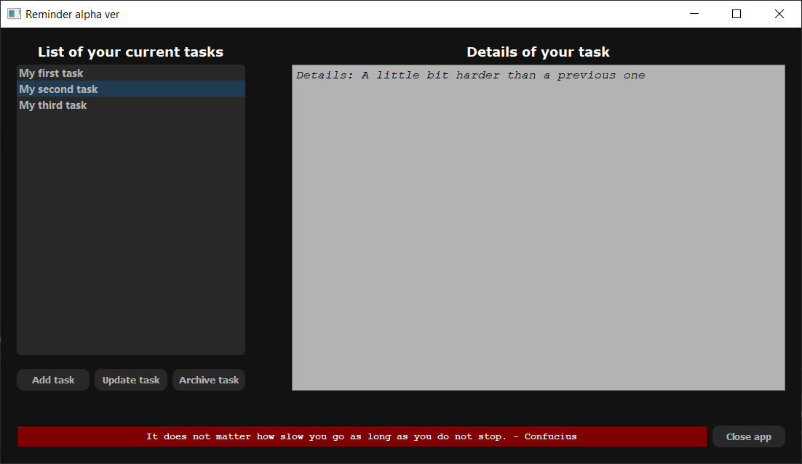

# Reminder
>
## Overview
An app developed with use of PyQt5 library that helps be organized and keeps track of user's progress in everyday life challenges. In addition it displays a motivational quote to boost morale.
## Current version info
 :construction::construction::construction:
## Installation
To be developed

You can try out the app by copying the source code and running it with IDE.
Dependencies:
- Python 3 (developed with use of 3.7 ver.)
- PyQt5